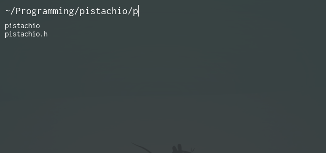

# pistachio
*A lightweight text-based application launcher*

## Configuration
Upon launching pistachio, it looks for the configuration file `~/.config/pistachio/configuration`.
If not found, it will create a new config file at that location with the default program options.

### Options

### `font-path <full path to font file>`
Sets the font to be used.

Default = `/usr/share/fonts/noto/NotoSansMono-Regular.ttf`

On most systems, pistachio will likely not find the default font.
On Ubuntu, for example, you might place `font-path /usr/share/fonts/truetype/ubuntu/UbuntuMono-R.ttf` in the configuration file.

### `search-font <size> [color] [style]`
Applies the following settings to the font used for the search bar:
- `<size>`
	- Size in points. Integers and decimal fractions are allowed, eg. 15 or 13.5.
- `[color]`
	- Optional. Represented as a 32-bit (8 digit) hexadecimal number in the format ARGB. The top two digits refer to Alpha (transparency), the next two refer to Red, then Green, then Blue.
	- Note that the `#` symbol is the comment symbol, so placing this in front of a colour will **prevent the colour from being used**.
- `[style]`
	- Optional. The only value currently supported is `oblique`, better known as *italics*.

### `results-font <size> [color] [style]`
Applies these settings to the font used for displaying search results.

### `error-font <size> [color] [style]`
Applies these settings to the font used for displaying error messages.

### `back-color <color>`
Sets the background colour to an ARGB colour value. Semi-transparent colours are supported. See `search-font` for more details on the expected format.

### `caret-color <color>`
Sets the colour of the caret (text cursor) to an ARGB colour value.

### `hl-color <color>`
Sets the background colour for the currently highlighted search result to an ARGB colour value.

### `window-width <size>`
Sets the width of the window as either a percentage of the screen or as a length in pixels, eg. 40% or 768px

### `window-height <size>`
Sets the height of the window as either a percentage of the screen or as a length in pixels, eg. 30% or 324px

### `folder-command <command>`
The command used for opening folders. A command can simply be the name of a program or it can be the start of a shell command, eg. `xfce4-terminal --default-working-directory=\`
where the path to the selected folder is appended to <command>.

### `default-command <command>`
The command used for a file which does not have an extension that is associated with a `program` or `command` option. The recommended value is the name of your text editor.

### `command <extension> <command>`
The command used for files that match the given file extension. Note that all file extensions must have the `.` provided, eg. `command .mp4 ffplay -fs`.

### `program <name> <extensions...>`
The program used for files that match one of the given file extensions. Note that a command with spaces can't be used here - only a program's name, eg. `program sxiv .png .bmp .jpg .gif`.

### `nodaemon <option> [params]`
Marks a configuration option such that when that program or command is launched, it won't be as a daemon process, eg. `nodaemon program firefox .html .htm`.

